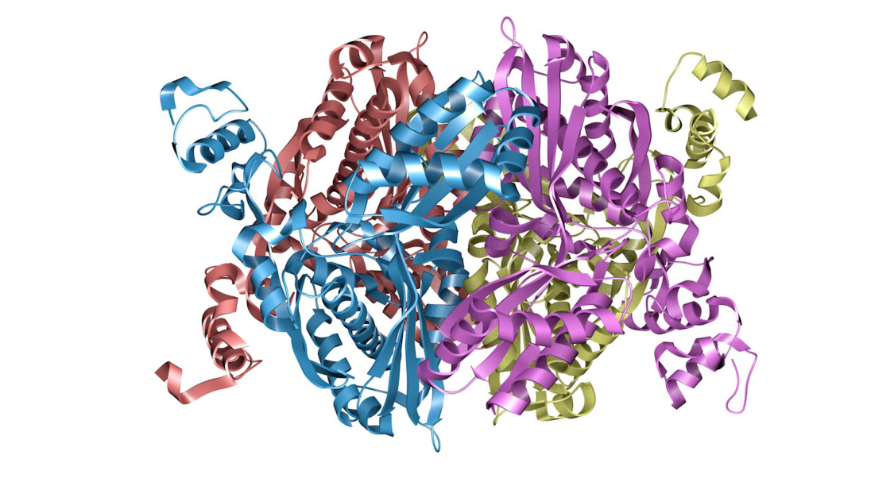
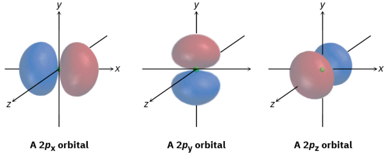
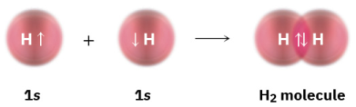
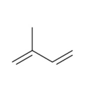
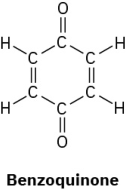
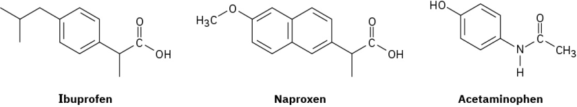

## CHAPTER 1
# Structure and Bonding

**FIGURE 1.1 The enzyme HMG–CoA reductase, shown here as a so-called ribbon model, catalyzes a crucial step in the body’s synthesis**
**ofcholesterol. Understanding how this enzyme unctions has led to the development ofdrugs credited with saving millions oflives. (credit:**
image rom the RCSB PDB (rcsb.org) ofPBD ID 1HW9 (E.S. Istvan, J. Deisenhoer) (2001) Structural mechanism or statin inhibition ofHMGCoA reductase Science 292: 1160–1164/RCSB PDB, CC BY 1.0)

**CHAPTER CONTENTS**

**1.1 Atomic Structure: The Nucleus**

**1.2 Atomic Structure: Orbitals**

**1.3 Atomic Structure: Electron Confgurations**

**1.4 Development ofChemical Bonding Theory**

**1.5 Describing Chemical Bonds: Valence Bond Theory**

**1.6 sp3** **Hybrid Orbitals and the Structure ofMethane**

**1.7 sp3** **Hybrid Orbitals and the Structure ofEthane**

**1.8 sp2** **Hybrid Orbitals and the Structure ofEthylene**

**1.9 sp Hybrid Orbitals and the Structure ofAcetylene**

**1.10 Hybridization ofNitrogen, Oxygen, Phosphorus, and Sulur**

**1.11 Describing Chemical Bonds: Molecular Orbital Theory**

**1.12 Drawing Chemical Structures**

**WHY THIS CHAPTER?** We’ll ease into the study oforganic chemistry by rst reviewing some ideas about atoms,

bonds, and molecular geometry that you may recall rom your general chemistry course. Much ofthe material
in this chapter and the next is likely to be amiliar to you, but it’s nevertheless a good idea to make sure you
understand it beore moving on.

What is organic chemistry, and why should you study it? The answers to these questions are all around you.

-----

Every living organism is made oforganic chemicals. The proteins that make up your hair, skin, and muscles;
the DNA that controls your genetic heritage; the oods that nourish you; and the medicines that heal you are all
organic chemicals. Anyone with a curiosity about lie and living things, and anyone who wants to be a part of
the remarkable advances taking place in medicine and the biological sciences, must rst understand organic
chemistry. Look at the ollowing drawings or instance, which show the chemical structures ofsome molecules
whose names might be amiliar to you. Although the drawings may appear unintelligible at this point, don’t
worry. They’ll make perectly good sense beore long, and you’ll soon be drawing similar structures or any
substance you’re interested in.

Historically, the term organic chemistry dates to the mid-1700s, when it was used to mean the chemistry of
substances ound in living organisms. Little was known about chemistry at that time, and the behavior ofthe
“organic” substances isolated rom plants and animals seemed dierent rom that ofthe “inorganic” substances
ound in minerals. Organic compounds were generally low-melting solids and were usually more dicult to
isolate, puriy, and work with than high-melting inorganic compounds.

By the mid-1800s, however, it was clear that there was no undamental dierence between organic and
inorganic compounds. The only distinguishing characteristic oforganic compounds is that all contain the
element carbon.

**Organic chemistry, then, is the study ofcarbon compounds. But why is carbon special? Why, ofthe more**
than 197 million presently known chemical compounds, do almost all ofthem contain carbon? The answers
to these questions come rom carbon’s electronic structure and its consequent position in the periodic table
(FIGURE 1.2). As a group 4A element, carbon can share our valence electrons and orm our strong covalent
bonds. Furthermore, carbon atoms can bond to one another, orming long chains and rings. Carbon, alone ofall
elements, is able to orm an immense diversity ofcompounds, rom the simple methane, with one carbon atom,
to the staggeringly complex DNA, which can have more than 100 million carbons.

**FIGURE 1.2 Carbon, hydrogen, and other elements commonly ound in organic compounds are shown in the colors typically used to**
**represent them.**

Not all carbon compounds are derived rom living organisms, however. Modern chemists have developed
a remarkably sophisticated ability to design and synthesize new organic compounds in the
laboratory—medicines, dyes, polymers, and a host ofother substances. Organic chemistry touches the lives of

-----

everyone. Its study can be a ascinating undertaking.

### 1.1 Atomic Structure: The Nucleus

As you might remember rom your general chemistry course, an atom consists ofa dense, positively charged
nucleus surrounded at a relatively large distance by negatively charged electrons (FIGURE 1.3). The nucleus
consists ofsubatomic particles called neutrons, which are electrically neutral, and protons, which are positively
charged. Because an atom is neutral overall, the number ofpositive protons in the nucleus and the number of
negative electrons surrounding the nucleus are the same.

**FIGURE 1.3 A schematic view ofan atom. The dense, positively charged nucleus contains most ofthe atom’s mass and is surrounded**
by negatively charged electrons. The three-dimensional view on the right shows calculated electron-density suraces. Electron density
increases steadily toward the nucleus and is 40 times greater at the blue solid surace than at the gray mesh surace.

Although extremely small—about 10[–14] to 10[–15] meter (m) in diameter—the nucleus nevertheless contains
essentially all the mass ofthe atom. Electrons have negligible mass and circulate around the nucleus at a
distance ofapproximately 10[–10] m. Thus, the diameter ofa typical atom is about 2 × 10[–10] m, or 200 picometers
(pm), where 1 pm = 10[–12] m. To give you an idea ofhow small this is, a thin pencil line is about 3 million
carbon atoms wide. Although most chemists throughout the world use the International System (SI) ofunits and
describe small distances in picometers, many organic chemists and biochemists in the United States still use
the unit angstrom (Å) to express atomic distances, where 1 Å = 100 pm = 10[–10] m. As you probably did in your
general chemistry course, however, we’ll stay with SI units in this book.

A specic atom is described by its atomic number (Z), which gives the number ofprotons (or electrons) it
contains, and its mass number (A), which gives the total number ofprotons and neutrons in its nucleus. All the
atoms ofa given element have the same atomic number: 1 or hydrogen, 6 or carbon, 15 or phosphorus, and
so on; but they can have dierent mass numbers depending on how many neutrons they contain. Atoms with
the same atomic number but dierent mass numbers are called isotopes. The element carbon, or instance, has
three isotopes that occur naturally, with mass numbers of12, 13, and 14. Carbon-12 has a natural abundance of
98.89%, carbon-13 has a natural abundance of1.11%, and carbon-14 has only a negligible natural abundance.

The weighted-average ofan element’s naturally occurring isotopes is called atomic weight and is given in
unied atomic mass units (u) or daltons (Da) where 1 u or 1 Da is dened as one twelth the mass ofone atom of
carbon-12. Thus, the atomic weight is 1.008 u or hydrogen, 12.011 u or carbon, 30.974 u or phosphorus, and
so on. Atomic weights ofall elements are given in the periodic table in Appendix D.

### 1.2 Atomic Structure: Orbitals

How are the electrons distributed in an atom? You might recall rom your general chemistry course that,
according to the quantum mechanical model, the behavior ofa specic electron in an atom can be described
by a mathematical expression called a wave equation—the same type ofexpression used to describe the motion
ofwaves in a fuid. The solution to a wave equation is called a wave unction, or orbital, and is denoted by the
lowercase Greek letter psi (ψ).

When the square ofthe wave unction, ψ2, is plotted in three-dimensional space, an orbital describes the
volume ofspace around a nucleus that an electron is most likely to occupy. You might thereore think ofan
orbital as looking like a photograph ofthe electron taken at a slow shutter speed. In such a photo, the orbital
would appear as a blurry cloud, indicating the region ofspace where the electron has been. This electron
cloud doesn’t have a sharp boundary, but or practical purposes we can set the limits by saying that an orbital
represents the space where an electron spends 90% to 95% ofits time.

What do orbitals look like? There are our dierent kinds oforbitals, denoted s, p, d, and , each with a dierent
shape. Othe our, we’ll be concerned primarily with s and p orbitals because these are the most common in

-----

organic and biological chemistry. An s orbital has a spherical shape, with the nucleus at its center; a p orbital
has a dumbbell shape with two parts, or lobes; and our ofthe ve d orbitals have a cloverleashape with our
lobes, as shown in FIGURE 1.4. The th d orbital is shaped like an elongated dumbbell with a doughnut around
its middle.

**FIGURE 1.4 Representations ofs, p, and d orbitals. An s orbital is spherical, a p orbital is dumbbell-shaped, and our ofthe fve d orbitals**
are cloverlea-shaped. Dierent lobes ofp orbitals are often drawn or convenience as teardrops, but their actual shape is more like that of
a doorknob, as indicated.

The orbitals in an atom are organized into dierent layers around the nucleus called electron shells, which
are centered around the nucleus and have successively larger size and energy. Dierent shells contain dierent
numbers and kinds oforbitals, and each orbital within a shell can be occupied by two electrons. The rst shell
contains only a single s orbital, denoted 1s, and thus holds only 2 electrons. The second shell contains one 2s
orbital and three 2p orbitals and thus holds a total of8 electrons. The third shell contains a 3s orbital, three 3p
orbitals, and ve 3d orbitals, or a total capacity of18 electrons. These orbital groupings and their energy levels
are shown in FIGURE 1.5.

**FIGURE 1.5 Energy levels ofelectrons in an atom. The frst shell holds a maximum of2 electrons in one 1s orbital; the second shell holds a**
maximum of8 electrons in one 2s and three 2p orbitals; the third shell holds a maximum of18 electrons in one 3s, three 3p, and 3d orbitals;
and so on. The two electrons in each orbital are represented by fve up and down arrows, Although not shown, the energy level ofthe 4s

orbital alls between 3p and 3d.

The three dierent p orbitals within a given shell are oriented in space along mutually perpendicular directions,
denoted px, py, and pz. As shown in FIGURE 1.6, the two lobes ofeach p orbital are separated by a region of
zero electron density called a node. Furthermore, the two orbital regions separated by the node have dierent
algebraic signs, + and −, in the wave unction, as represented by the dierent colors in FIGURE 1.4 and FIGURE

**1.6. As we’ll see in Section 1.11, these algebraic signs or dierent orbital lobes have important consequences**

with respect to chemical bonding and chemical reactivity.

-----

**FIGURE 1.6 Shapes ofthe 2p orbitals. Each ofthe three mutually perpendicular, dumbbell-shaped orbitals has two lobes separated by a**
node. The two lobes have dierent algebraic signs in the corresponding wave unction, as indicated by the dierent colors.

### 1.3 Atomic Structure: Electron Confgurations

The lowest-energy arrangement, or ground-state electron conguration, ofan atom is a list ofthe orbitals
occupied by its electrons. We can predict this arrangement by ollowing three rules.

**RULE 1**

graphic, a statement called the Aubau principle. Note that the 4s orbital lies between the 3p and 3d orbitals in
energy.

**RULE 2**
Electrons act in some ways as ithey were spinning around an axis, somewhat as the earth spins. This spin can
have two orientations, denoted as up (↑) and down (↓). Only two electrons can occupy an orbital, and they must
have opposite spins, a statement called the Pauli exclusion principle.

**RULE 3**
Itwo or more empty orbitals ofequal energy are available, one electron occupies each with spins parallel until
all orbitals are hal-ull, a statement called Hund’s rule.

Some examples ofhow these rules apply are shown in TABLE 1.1. Hydrogen, or instance, has only one electron,
which must occupy the lowest-energy orbital. Thus, hydrogen has a 1s ground-state conguration. Carbon has
six electrons and the ground-state conguration 1s22s22px12py1, and so orth. Note that a superscript is used
to represent the number ofelectrons in a particular orbital.

-----

**TABLE 1.1 Ground-State Electron Congurations ofSome**
**Elements**

|Element|Atomic number|Conguration|
|---|---|---|
|Hydrogen|1||
|Carbon|6||
|Phosphorus|15||

**PROBLEM** What is the ground-state electron conguration ofeach ofthe ollowing elements:
**1-1** **(a) Oxygen (b) Nitrogen (c)** Sulur

**PROBLEM** How many electrons does each ofthe ollowing biological trace elements have in its outermost
**1-2** electron shell?
**(a) Magnesium (b) Cobalt (c)** Selenium

### 1.4 Development ofChemical Bonding Theory

By the mid-1800s, the new science ofchemistry was developing rapidly, especially in Europe, and chemists
had begun to probe the orces holding compounds together. In 1858, the German chemist August Kekulé
and the Scottish chemist Archibald Couper independently proposed that, in all organic compounds, carbon is
tetravalent—it always orms our bonds when it joins other elements to orm stable compounds. Furthermore,
said Kekulé, carbon atoms can bond to one another to orm extended chains oflinked atoms. In 1865, Kekulé
provided another major advance when he suggested that carbon chains can double back on themselves to orm
rings ofatoms.

Although Kekulé and Couper were correct in describing the tetravalent nature ofcarbon, chemistry was still
viewed in a two-dimensional way until 1874. In that year, the Dutch chemist Jacobus van’t Hoand French
chemist Joseph Le Bel added a third dimension to our ideas about organic compounds when they proposed that
the our bonds ofcarbon are not oriented randomly but have specic spatial directions. Van’t Howent even
urther and suggested that the our atoms to which carbon is bonded sit at the corners ofa regular tetrahedron,
with carbon in the center.

A representation ofa tetrahedral carbon atom is shown in FIGURE 1.7. Note the conventions used to show threedimensionality: solid lines represent bonds in the plane ofthe page, the heavy wedged line represents a bond
coming out ofthe page toward the viewer, and the dashed line represents a bond receding back behind the page,
away rom the viewer. Get used to them; these representations will be used throughout the text.

-----

**FIGURE 1.7 A representation ofvan’t Ho’s tetrahedral carbon atom. The solid lines represent bonds in the plane ofthe paper, the heavy**
wedged line represents a bond coming out ofthe plane ofthe page toward the viewer, and the dashed line represents a bond going back
behind the plane ofthe page away rom the viewer.

Why, though, do atoms bond together, and how can chemical bonds be described electronically? The why
question is relatively easy to answer: atoms bond together because the compound that results is more stable
and lower in energy than the separate atoms. Energy—usually as heat—is always released and fows out ofthe
chemical system when a bond orms. Conversely, energy is added to the chemical system when a bond breaks.
Making bonds always releases energy, and breaking bonds always absorbs energy. The how question is more
dicult. To answer it, we need to know more about the electronic properties ofatoms.

We know through observation that eight electrons (an electron octet) in an atom’s outermost shell, or valence
**shell, impart special stability to the noble-gas elements in group 8A ofthe periodic table: Ne (2 + 8); Ar (2 + 8 +**
8); Kr (2 + 8 + 18 + 8). We also know that the chemistry ofthe main-group elements on the let and right sides
ofthe periodic table is governed by their tendency to take on the electron conguration ofthe nearest noble
gas. The alkali metals such as sodium in group 1A, or example, achieve a noble-gas conguration by losing
the single s electron rom their valence shell to orm a cation, while the halogens such as chlorine in group
7A achieve a noble-gas conguration by gaining a p electron to ll their valence shell and orm an anion. The
resultant ions are held together in compounds like Na[+] Cl[–] by the electrical attraction ofunlike charges that we
call an ionic bond.

But how do elements closer to the middle ofthe periodic table orm bonds? Look at methane, CH4, the main
constituent ofnatural gas, or example. The bonding in methane is not ionic because it would take too much
energy or carbon (1s2 2s2 2p2) either to gain or lose our electrons to achieve a noble-gas conguration.
Instead, carbon bonds to other atoms, not by gaining or losing electrons, but by sharing them. Such a sharedelectron bond, rst proposed in 1916 by the American chemist G. N. Lewis, is called a covalent bond. The
neutral collection ofatoms held together by covalent bonds is called a molecule. Ionic compounds such as
sodium chloride, however, are not called molecules.

A simple way ofindicating the covalent bonds in molecules is to use what are called Lewis structures, or
**electron-dot structures, in which the valence-shell electrons ofan atom are represented as dots. Thus,**
hydrogen has one dot representing its 1s electron, carbon has our dots (2s2 2p2), oxygen has six dots (2s2 2p4),
and so on. A stable molecule results whenever a noble-gas conguration ofeight dots (an octet) is achieved
or all main-group atoms or two dots or hydrogen. Even simpler than Lewis structures is the use of **Kekulé**
**structures, or line-bond structures, in which the two-electron covalent bonds are indicated as lines drawn**
between atoms.

-----

The number ofcovalent bonds an atom orms depends on how many additional valence electrons it needs to
reach a noble-gas conguration. Hydrogen has one valence electron (1s) and needs only one more to reach the
helium conguration (1s2), so it orms one bond. Carbon has our valence electrons (2s2 2p2) and needs our
more to reach the neon conguration (2s2 2p6), so it orms our bonds. Nitrogen has ve valence electrons (2s2

2p3), needs three more, and orms three bonds; oxygen has six valence electrons (2s2 2p4), needs two more, and
orms two bonds; and the halogens have seven valence electrons, need one more, and orm one bond.

Valence electrons that are not used or bonding remain as dots in structures and are called lone-pair electrons,
or nonbonding electrons. The nitrogen atom in ammonia, NH3, or instance, shares six valence electrons in
three covalent bonds and has its remaining two valence electrons as two dots in a nonbonding lone pair. As a
time-saving shorthand, nonbonding electrons are often omitted when drawing line-bond structures, but you
still have to keep them in mind since they’re often crucial in chemical reactions.

WORKED EXAMPLE 1.1

**Predicting the Number ofBonds Formed by Atoms in Molecules**

How many hydrogen atoms does phosphorus bond to in orming phosphine, PH??

**Strategy**

Identiy the periodic group ofphosphorus, and nd rom that how many electrons (bonds) are needed to make
an octet.

**Solution**

Phosphorus is in group 5A ofthe periodic table and has ve valence electrons. It thus needs to share three more
electrons to make an octet and thereore bonds to three hydrogen atoms, giving PH3.

WORKED EXAMPLE 1.2

**Drawing Electron-Dot and Line-Bond Structures**

Draw both electron-dot and line-bond structures or chloromethane, CH3Cl.

-----

**Strategy**

Remember that a covalent bond—that is, a pair ofshared electrons—is represented as a line between atoms.

**Solution**

Hydrogen has one valence electron, carbon has our valence electrons, and chlorine has seven valence
electrons. Thus, chloromethane is represented as

**PROBLEM** Draw a molecule ofchloroorm, CHCl3, using solid, wedged, and dashed lines to show its tetrahedral
**1-3** geometry.

**PROBLEM** Convert the ollowing representation ofethane, C2H6, into a conventional drawing that uses solid,
**1-4** wedged, and dashed lines to indicate tetrahedral geometry around each carbon (black = C, gray =
H).

**PROBLEM** What are likely ormulas or the ollowing substances?
**1-5** **(a) CCl? (b) AlH? (c)** CH?Cl2 (d) SiF (e) CH3NH?

**PROBLEM** Write line-bond structures or the ollowing substances, showing all nonbonding electrons:
**1-6** **(a) CHCl3, chloroorm (b) H2S, hydrogen sulde (c)** CH3NH2, methylamine

**(d) CH3Li, methyllithium**

**PROBLEM** Why can’t an organic molecule have the ormula C2H7?
**1-7**

### 1.5 Describing Chemical Bonds: Valence Bond Theory

How does electron sharing lead to bonding between atoms? Two models have been developed to describe
covalent bonding: valence bond theory and molecular orbital theory. Each model has its strengths and
weaknesses, and chemists tend to use them interchangeably depending on the circumstances. Valence bond
theory is the more easily visualized ofthe two, so most ofthe descriptions we’ll use in this book derive rom that
approach.

According to valence bond (VB) theory, a covalent bond orms when two atoms approach each other closely
and a singly occupied orbital on one atom overlaps a singly occupied orbital on the other atom. The electrons
are now paired in the overlapping orbitals and are attracted to the nuclei ofboth atoms, thus bonding the
atoms together. In the H2 molecule, or instance, the H–H bond results rom the overlap oftwo singly occupied
hydrogen 1s orbitals.

-----

The overlapping orbitals in the H2 molecule have the elongated egg shape we might get by pressing two
spheres together. Ia plane were to pass through the middle ofthe bond, the intersection ofthe plane and the
overlapping orbitals would be a circle. In other words, the H–H bond is cylindrically symmetrical, as shown in
**FIGURE 1.8. Such bonds, which are ormed by the head-on overlap oftwo atomic orbitals along a line drawn**
between the nuclei, are called sigma (σ) bonds.

**FIGURE 1.8 The cylindrical symmetry ofthe H–H σ bond in an H2 molecule. The intersection ofa plane cutting through the σ bond is a**
circle.

During the bond-orming reaction 2H· ⟶ H2, 436 kJ/mol (104 kcal/mol) ofenergy is released. Because the
product H2 molecule has 436 kJ/mol less energy than the starting 2 H· atoms, the product is more stable than
the reactant and we say that the H–H bond has a bond strength of436 kJ/mol. In other words, we would have to
put 436 kJ/mol ofenergy into the H–H bond to break the H2 molecule apart into two H atoms (FIGURE 1.9). For
convenience, we’ll generally give energies in both kilocalories (kcal) and the SI unit kilojoules (kJ): 1 kJ = 0.2390
kcal; 1 kcal = 4.184 kJ.

**FIGURE 1.9 Relative energy levels oftwo H atoms and the H2 molecule. The H2 molecule has 436 kJ/mol (104 kcal/mol) less energy than**
the two separate H atoms, so 436 kJ/mol ofenergy is released when the H–H bond orms. Conversely, 436 kJ/mol is absorbed when the
**H–H bond breaks.**

How close are the two nuclei in the H2 molecule? Ithey are too close, they will repel each other because both
are positively charged. Yet ithey’re too ar apart, they won’t be able to share the bonding electrons. Thus, there
is an optimum distance between nuclei that leads to maximum stability (FIGURE 1.10). Called the bond length,
this distance is 74 pm in the H–H molecule. Every covalent bond has both a characteristic bond strength and
bond length.

-----

**FIGURE 1.10 A plot ofenergy versus internuclear distance or two hydrogen atoms. The distance between nuclei at the minimum energy**
point is the bond length.

### 1.6 sp3 Hybrid Orbitals and the Structure ofMethane

The bonding in the hydrogen molecule is airly straightorward, but the situation is more complicated in organic
molecules with tetravalent carbon atoms. Take methane, CH4, or instance. As we’ve seen, carbon has our
valence electrons (2s2 2p2) and orms our bonds. Because carbon uses two kinds oforbitals or bonding, 2s and
2p, we might expect methane to have two kinds ofC–H bonds. In act, though, all our C–H bonds in methane are
identical and are spatially oriented toward the corners ofa regular tetrahedron, as shown previously in FIGURE

**1.7. How can we explain this?**

An answer was provided in 1931 by Linus Pauling, who showed mathematically how an s orbital and three
p orbitals on an atom can combine, or hybridize, to orm our equivalent atomic orbitals with tetrahedral
orientation. Shown in FIGURE 1.11, these tetrahedrally oriented orbitals are called sp3 **hybrid orbitals. Note**
that the superscript 3 in the name sp3 tells how many ofeach type ofatomic orbital combine to orm the hybrid,
not how many electrons occupy it.

**FIGURE 1.11 Four sp3** **hybrid orbitals, oriented toward the corners ofa regular tetrahedron, are ormed by the combination ofan**
**s orbital and three p orbitals (red/blue). The sp3** hybrids have two lobes and are unsymmetrical about the nucleus, giving them a
directionality and allowing them to orm strong bonds to other atoms.

The concept ofhybridization explains how carbon orms our equivalent tetrahedral bonds but not why it does
so. The shape ofthe hybrid orbital suggests the answer to why. When an s orbital hybridizes with three p orbitals,
the resultant sp3 hybrid orbitals are unsymmetrical about the nucleus. One ofthe two lobes is larger than the
other and can thereore overlap more eectively with an orbital rom another atom to orm a bond. As a result,

-----

sp3 hybrid orbitals orm stronger bonds than do unhybridized s or p orbitals.

The asymmetry ofsp3 orbitals arises because, as noted previously, the two lobes ofa p orbital have dierent
algebraic signs, + and –, in the wave unction. Thus, when a p orbital hybridizes with an s orbital, the positive
p lobe adds to the s orbital but the negative p lobe subtracts rom the s orbital. The resultant hybrid orbital is
thereore unsymmetrical about the nucleus and is strongly oriented in one direction.

When each ofthe our identical sp3 hybrid orbitals ofa carbon atom overlaps with the 1s orbital ofa hydrogen
atom, our identical C–H bonds are ormed and methane results. Each C–H bond in methane has a strength of
439 kJ/mol (105 kcal/mol) and a length of109 pm. Because the our bonds have a specic geometry, we also can
dene a property called the bond angle. The angle ormed by each H–C–H is 109.5°, the so-called tetrahedral
angle. Methane thus has the structure shown in FIGURE 1.12.

**FIGURE 1.12 The structure ofmethane, showing its 109.5° bond angles.**

### 1.7 sp3 Hybrid Orbitals and the Structure ofEthane

The same kind oforbital hybridization that accounts or the methane structure also accounts or the bonding
together ofcarbon atoms into chains and rings to make possible many millions oforganic compounds. Ethane,
C2H6, is the simplest molecule containing a carbon–carbon bond.

We can picture the ethane molecule by imagining that the two carbon atoms bond to each other by head-on
sigma (σ) overlap ofan sp3 hybrid orbital rom each (FIGURE 1.13). The remaining three sp3 hybrid orbitals on
each carbon overlap with the 1s orbitals ofthree hydrogens to orm the six C–H bonds. The C–H bonds in ethane
are similar to those in methane, although a bit weaker: 421 kJ/mol (101 kcal/mol) or ethane versus 439 kJ/mol
or methane. The C–C bond is 153 pm in length and has a strength of377 kJ/mol (90 kcal/mol). All the bond
angles ofethane are near, although not exactly at, the tetrahedral value of109.5°.

**FIGURE 1.13 The structure ofethane. The carbon–carbon bond is ormed by σ overlap oftwo sp3** **hybrid orbitals. For clarity, the smaller**

-----

lobes ofthe sp3 hybrid orbitals are not shown.

**PROBLEM** Draw a line-bond structure or propane, CH3CH2CH3. Predict the value ofeach bond angle, and
**1-8** indicate the overall shape ofthe molecule.

**PROBLEM** Convert the ollowing molecular model ofhexane, a component ofgasoline, into a line-bond
**1-9** structure (black = C, gray = H).

### 1.8 sp2 Hybrid Orbitals and the Structure ofEthylene

The bonds we’ve seen in methane and ethane are called single bonds because they result rom the sharing of
one electron pair between bonded atoms. It was recognized nearly 150 years ago, however, that carbon atoms
can also orm double bonds by sharing two electron pairs between atoms or triple bonds by sharing three

while acetylene has the structure and contains a carbon–carbon triple bond.

How are multiple bonds described by valence bond theory? When we discussed sp3 hybrid orbitals in Section
**1.6, we said that the our valence-shell atomic orbitals ofcarbon combine to orm our equivalent sp3** hybrids.
Imagine instead that the 2s orbital combines with only two ofthe three available 2p orbitals. Three sp2 **hybrid**
**orbitals result, and one 2p orbital remains unchanged. Like sp3** hybrids, sp2 hybrid orbitals are unsymmetrical
about the nucleus and are strongly oriented in a specic direction so they can orm strong bonds. The three sp2

orbitals lie in a plane at angles of120° to one another, with the remaining p orbital perpendicular to the sp2

plane, as shown in FIGURE 1.14.

**FIGURE 1.14 sp2** **Hybridization. The three equivalent sp2** **hybrid orbitals lie in a plane at angles of120° to one another, and a single**
unhybridized p orbital (red/blue) is perpendicular to the sp2 plane.

When two carbons with sp2 hybridization approach each other, they orm a strong σ bond by sp2–sp2 head-on
overlap. At the same time, the unhybridized p orbitals interact by sideways overlap to orm what is called a pi
**(π) bond. The combination ofan sp2–sp2** σ bond and a 2p–2p π bond results in the sharing ofour electrons and
the ormation ofa carbon–carbon double bond (FIGURE 1.15). Note that the electrons in the σ bond occupy the
region centered between nuclei, while the electrons in the π bond occupy regions above and below a line drawn
between nuclei.

To complete the structure ofethylene, our hydrogen atoms orm σ bonds with the remaining our sp2 orbitals.
Ethylene thus has a planar structure, with H–C–H and H–C–C bond angles ofapproximately 120°. (The actual
values are 117.4° or the H–C–H bond angle and 121.3° or the H–C–C bond angle.) Each C–H bond has a length
of108.7 pm and a strength of464 kJ/mol (111 kcal/mol).

-----

**FIGURE 1.15 The structure ofethylene. One part ofthe double bond in ethylene results rom σ (head-on) overlap of** **sp2** **hybrid orbitals,**
and the other part results rom π (sideways) overlap ofunhybridized p orbitals (red/blue). The π bond has regions ofelectron density above
and below a line drawn between nuclei.

As you might expect, the carbon–carbon double bond in ethylene is both shorter and stronger than the single
bond in ethane because it has our electrons bonding the nuclei together rather than two. Ethylene has a
bond length of134 pm and a strength of728 kJ/mol (174 kcal/mol) versus a C–C length of153 pm and a strength
of377 kJ/mol or ethane. The carbon–carbon double bond is less than twice as strong as a single bond because
the sideways overlap in the π part ofthe double bond is not as great as the head-on overlap in the σ part.

WORKED EXAMPLE 1.3

**Drawing Electron-Dot and Line-Bond Structures**

Commonly used in biology as a tissue preservative, ormaldehyde, CH2O, contains a carbon–oxygen double
bond. Draw electron-dot and line-bond structures oformaldehyde, and indicate the hybridization ofthe carbon
orbitals.

**Strategy**

We know that hydrogen orms one covalent bond, carbon orms our, and oxygen orms two. Trial and error,
combined with intuition, is needed to t the atoms together.

**Solution**

There is only one way that two hydrogens, one carbon, and one oxygen can combine:

Like the carbon atoms in ethylene, the carbon atom in ormaldehyde is in a double bond and its orbitals are
thereore sp2-hybridized.

**PROBLEM** Draw a line-bond structure or propene, CH3CH CH2. Indicate the hybridization ofthe orbitals on
**1-10** each carbon, and predict the value ofeach bond angle.

**PROBLEM** Draw a line-bond structure or 1,3-butadiene, H2C CH–CH CH2. Indicate the hybridization ofthe
**1-11** orbitals on each carbon, and predict the value ofeach bond angle.

-----

**PROBLEM** A molecular model ofaspirin (acetylsalicylic acid) is shown. Identiy the hybridization ofthe
**1-12** orbitals on each carbon atom in aspirin, and tell which atoms have lone pairs ofelectrons (black =
C, red = O, gray = H).

### 1.9 sp Hybrid Orbitals and the Structure ofAcetylene

In addition to orming single and double bonds by sharing two and our electrons, respectively, carbon can also
orm a triple bond by sharing six electrons. To account or the triple bond in a molecule such as acetylene,

, we need a third kind ofhybrid orbital, an sp hybrid. Imagine that, instead ofcombining with two
or three p orbitals, a carbon 2s orbital hybridizes with only a single p orbital. Two sp hybrid orbitals result, and
two p orbitals remain unchanged. The two sp orbitals are oriented 180° apart on the right-let (x) axis, while the
p orbitals are perpendicular on the up-down (y) axis and the in-out (z) axis, as shown in FIGURE 1.16.

**FIGURE 1.16 sp Hybridization. The two sp hybrid orbitals are oriented 180° away rom each other, perpendicular to the two remaining p**
**orbitals (red/blue).**

When two sp-hybridized carbon atoms approach each other, sp hybrid orbitals on each carbon overlap headon to orm a strong sp–sp σ bond. At the same time, the pz orbitals rom each carbon orm a pz–pz π bond by
sideways overlap, and the py orbitals overlap similarly to orm a py–py π bond. The net eect is the sharing of
six electrons and ormation ofa carbon–carbon triple bond. Each ofthe two remaining sp hybrid orbitals orms
a σ bond with hydrogen to complete the acetylene molecule (FIGURE 1.17).

-----

**FIGURE 1.17 The structure ofacetylene. The two carbon atoms are joined by one sp–sp σ bond and two p–p π bonds.**

As suggested by sp hybridization, acetylene is a linear molecule with H–C–C bond angles of180°. The C–H
bonds have a length of106 pm and a strength of558 kJ/mol (133 kcal/mol). The C–C bond length in acetylene
is 120 pm, and its strength is about 965 kJ/mol (231 kcal/mol), making it the shortest and strongest ofany
carbon–carbon bond. A comparison ofsp, sp2, and sp3 hybridization is given in TABLE 1.2.

**TABLE 1.2 Comparison ofC−C and C−H Bonds in Methane, Ethane, Ethylene, and Acetylene**

**Molecule** **Bond** **Bond strength** **Bond length (pm)**

|Col1|Col2|(kJ/mol)|(kcal/mol)|Col5|
|---|---|---|---|---|
|Methane, CH 4|(sp3) C−H|439|105|109|
|Ethane, CH CH 3 3|(sp3) C−C (sp3)|377|90|153|
||(sp3) C−H|421|101|109|
|Ethylene, H C=CH 2 2|(sp2) (sp2)|728|174|134|
||(sp2) C−H|464|111|109|
|Acetylene,|(sp) (sp)|965|231|120|
||(sp) C−H|558|133|106|

**PROBLEM** Draw a line-bond structure or propyne, CH3C CH. Indicate the hybridization ofthe orbitals on
**1-13** each carbon, and predict a value or each bond angle.

### 1.10 Hybridization ofNitrogen, Oxygen, Phosphorus, and Sulur

The valence-bond concept oforbital hybridization described in the previous our sections is not limited to
carbon. Covalent bonds ormed by other elements can also be described using hybrid orbitals. Look, or
instance, at the nitrogen atom in methylamine (CH3NH2), an organic derivative ofammonia (NH3) and the
substance responsible or the odor ofrotting sh.

The experimentally measured H–N–H bond angle in methylamine is 107.1°, and the C–N–H bond angle is

-----

110.3°, both ofwhich are close to the 109.5° tetrahedral angle ound in methane. We thereore assume that
nitrogen orms our sp3-hybridized orbitals, just as carbon does. One ofthe our sp3 orbitals is occupied by two
nonbonding electrons (a lone pair), and the other three hybrid orbitals have one electron each. Overlap ofthese
three hal-lled nitrogen orbitals with hal-lled orbitals rom other atoms (C or H) gives methylamine. Note that
the unshared lone pair ofelectrons in the ourth sp3 hybrid orbital ofnitrogen occupies as much space as an
N–H bond does and is very important to the chemistry ofmethylamine and other nitrogen-containing organic
molecules.

Like the carbon atom in methane and the nitrogen atom in methylamine, the oxygen atom in methanol (methyl
alcohol) and many other organic molecules can be described as sp3-hybridized. The C–O–H bond angle in
methanol is 108.5°, very close to the 109.5° tetrahedral angle. Two ofthe our sp3 hybrid orbitals on oxygen are
occupied by nonbonding electron lone pairs, and two are used to orm bonds.

In the periodic table, phosphorus and sulur are the third-row analogs ofnitrogen and oxygen, and the bonding
in both can be described using hybrid orbitals. Because oftheir positions in the third row, however, both
phosphorus and sulur can expand their outer-shell octets and orm more than the typical number ofcovalent
bonds. Phosphorus, or instance, often orms ve covalent bonds, and sulur often orms our.

Phosphorus is most commonly encountered in biological molecules in compounds called organophosphates,
which contain a phosphorus atom bonded to our oxygens, with one ofthe oxygens also bonded to carbon.
Methyl phosphate, CH3OPO3[2−], is the simplest example. The O–P–O bond angle in such compounds is typically
in the range 110° to 112°, implying sp3 hybridization or phosphorus orbitals.

Sulur is most commonly encountered in biological molecules either in compounds called thiols, which have a
sulur atom bonded to one hydrogen and one carbon, C–S–H or in suldes, which have a sulur atom bonded to
two carbons, C–S–C. Produced by some bacteria, methanethiol (CH3SH) is the simplest example ofa thiol, and
dimethyl sulde, H3C–S–CH3, is the simplest example ofa sulde. Both can be described by approximate sp3

hybridization around sulur, although both have signicant deviation rom the 109.5° tetrahedral angle.

-----

**PROBLEM** Identiy all nonbonding lone pairs ofelectrons in the ollowing molecules, and tell what geometry
**1-14** you expect or each ofthe indicated atoms.
**(a) The oxygen atom in dimethyl ether, CH3–O–CH3 (b) The nitrogen atom in trimethylamine,**

**(c)** The phosphorus atom in phosphine, PH3
**(d) The sulur atom in the amino acid methionine,**

### 1.11 Describing Chemical Bonds: Molecular Orbital Theory

We said in Section 1.5 that chemists use two models or describing covalent bonds: valence bond theory and
molecular orbital theory. Having now seen the valence bond approach, which uses hybrid atomic orbitals to
account or geometry and assumes the overlap ofatomic orbitals to account or electron sharing, let’s look
briefy at the molecular orbital approach to bonding. We’ll return to this topic in Chapters 14, 15, and 30 or a
more in-depth discussion.

**Molecular orbital (MO) theory describes covalent bond ormation as arising rom a mathematical combination**
ofatomic orbitals (wave unctions) on dierent atoms to orm molecular orbitals, so called because they belong
to the entire molecule rather than to an individual atom. Just as an atomic orbital, whether unhybridized or
hybridized, describes a region ofspace around an atom where an electron is likely to be ound, so a molecular
orbital describes a region ofspace in a molecule where electrons are most likely to be ound.

Like an atomic orbital, a molecular orbital has a specic size, shape, and energy. In the H2 molecule, or
example, two singly occupied 1s atomic orbitals combine to orm two molecular orbitals. There are two ways
or the orbital combination to occur—an additive way and a subtractive way. The additive combination leads
to ormation ofa molecular orbital that is lower in energy and roughly egg-shaped, while the subtractive
combination leads to a molecular orbital that is higher in energy and has a node between nuclei (FIGURE 1.18).
Note that the additive combination is a single, egg-shaped, molecular orbital; it is not the same as the two
overlapping 1s atomic orbitals ofthe valence bond description. Similarly, the subtractive combination is a single
molecular orbital with the shape ofan elongated dumbbell.

-----

**FIGURE 1.18 Molecular orbitals ofH2. Combination oftwo hydrogen 1s atomic orbitals leads to two H2 molecular orbitals. The lower-**
energy, bonding MO is flled, and the higher-energy, antibonding MO is unflled.

The additive combination is lower in energy than the two hydrogen 1s atomic orbitals and is called a bonding
**MO because electrons in this MO spend most oftheir time in the region between the two nuclei, thereby bonding**
the atoms together. The subtractive combination is higher in energy than the two hydrogen 1s orbitals and is
called an antibonding MO because any electrons it contains can’t occupy the central region between the nuclei,
where there is a node, and thus can’t contribute to bonding. The two nuclei thereore repel each other.

Just as bonding and antibonding σ molecular orbitals result rom the head-on combination oftwo s atomic
orbitals in H2, so bonding and antibonding π molecular orbitals result rom the sideways combination oftwo
p atomic orbitals in ethylene. As shown in FIGURE 1.19, the lower-energy, π bonding MO has no node between
nuclei and results rom the combination ofp orbital lobes with the same algebraic sign. The higher-energy, π
antibonding MO has a node between nuclei and results rom the combination oflobes with opposite algebraic
signs. Only the bonding MO is occupied; the higher-energy, antibonding MO is vacant. We’ll see in Chapters 14,
15, and 30 that molecular orbital theory is particularly useul or describing π bonds in compounds that have
more than one double bond.

**FIGURE 1.19 A molecular orbital description ofthe C–C π bond in ethylene. The lower-energy, π bonding MO results rom an additive**
combination ofp orbital lobes with the same algebraic sign and is flled. The higher-energy, π antibonding MO results rom a subtractive
combination ofp orbital lobes with opposite algebraic signs and is unflled.

### 1.12 Drawing Chemical Structures

Let’s cover just one more point beore ending this introductory chapter. In the structures we’ve been drawing
until now, a line between atoms has represented the two electrons in a covalent bond. Drawing every bond
and every atom is tedious, however, so chemists have devised several shorthand ways or writing structures.
In condensed structures, carbon–hydrogen and carbon–carbon single bonds aren’t shown; instead, they’re
understood. Ia carbon has three hydrogens bonded to it, we write CH3; ia carbon has two hydrogens bonded
to it, we write CH2; and so on. The compound called 2-methylbutane, or example, is written as ollows:

-----

Note that the horizontal bonds between carbons aren’t shown in condensed structures—the CH3, CH2, and
CH units are simply placed next to each other—but vertical carbon–carbon bonds like that ofthe rst ofthe
condensed structures drawn above is shown or clarity. Notice also in the second ofthe condensed structures
that the two CH3 units attached to the CH carbon are grouped together as (CH3)2.

Even simpler than condensed structures are skeletal structures such as those shown in TABLE 1.3. The rules
or drawing skeletal structures are straightorward.

**RULE 1**
Carbon atoms aren’t usually shown. Instead, a carbon atom is assumed to be at each intersection oftwo lines
(bonds) and at the end ofeach line. Occasionally, a carbon atom might be indicated or emphasis or clarity.

**RULE 2**
Hydrogen atoms bonded to carbon aren’t shown. Because carbon always has a valence of4, we mentally supply
the correct number ofhydrogen atoms or each carbon.

**RULE 3**
Atoms other than carbon and hydrogen are shown.

One urther comment: Although such groupings as –CH3, –OH, and –NH2 are usually written with the C, O, or N
atom rst and the H atom second, the order ofwriting is sometimes inverted to H3C–, HO–, and H2N– ineeded
to make the bonding connections clearer. Larger units such as –CH2CH3 are not inverted, though; we don’t
write H3CH2C– because it would be conusing. There are, however, no well-dened rules that cover all cases; it’s
largely a matter ofpreerence.

**TABLE 1.3 Line-bond and Skeletal Structures or Some Compounds**

|Compound|Line-bond structure|Skeletal structure|
|---|---|---|
|Isoprene, C H 5 8|||
|Methylcyclohexane, C H 7 14|||
|Phenol, C H O 6 6|||

-----

WORKED EXAMPLE 1.4

**Interpreting a Line-Bond Structure**

Carvone, a substance responsible or the odor ofspearmint, has the ollowing structure. Tell how many
hydrogens are bonded to each carbon, and give the molecular ormula ofcarvone.

**Strategy**

The end ofa line represents a carbon atom with 3 hydrogens, CH3; a two-way intersection is a carbon atom with
2 hydrogens, CH2; a three-way intersection is a carbon atom with 1 hydrogen, CH; and a our-way intersection
is a carbon atom with no attached hydrogens.

**Solution**

**PROBLEM** How many hydrogens are bonded to each carbon in the ollowing compounds, and what is the
**1-15** molecular ormula ofeach substance?

**PROBLEM** Propose skeletal structures or compounds that satisy the ollowing molecular ormulas: There is
**1-16** more than one possibility in each case.
**(a) C5H12 (b) C2H7N (c)** C3H6O (d) C4H9Cl

**PROBLEM** The ollowing molecular model is a representation ofpara-aminobenzoic acid (PABA), the active
**1-17** ingredient in many sunscreens. Indicate the positions ofthe multiple bonds, and draw a skeletal
structure (black = C, red = O, blue = N, gray = H).

-----

# CHEMISTRY MATTERS

### Organic Foods: Risk versus Beneft

Contrary to what you may hear in supermarkets or on television, all oods are organic—that is, complex mixtures
oforganic molecules. Even so, when applied to ood, the word organic has come to mean an absence ofsynthetic
chemicals, typically pesticides, antibiotics, and preservatives. How concerned should we be about traces of
pesticides in the ood we eat? Or toxins in the water we drink? Or pollutants in the air we breathe?

Lie is not risk-ree—we all take many risks each day without even thinking about it. We decide to ride a bike
rather than drive, even though there is a ten times greater likelihood per mile ofdying in a bicycling accident
than in a car. We decide to walk down stairs rather than take an elevator, even though 32,000 people die rom
alls each year in the United States. Some ofus decide to smoke cigarettes, even though it increases our chance
ofgetting cancer by 50%. But what about risks rom chemicals like pesticides?

**FIGURE 1.20 How dangerous is the pesticide being sprayed on this crop? (credit: “NRCSAR83001(265)” by USDA Natural Resources**
Conservation Service/Wikimedia Commons, Public Domain)

One thing is certain: without pesticides, whether they target weeds (herbicides), insects (insecticides), or molds
and ungi (ungicides), crop production would drop signicantly, ood prices would increase, and amines would
occur in less developed parts ofthe world. Take the herbicide atrazine, or instance. In the United States
alone, approximately 100 million pounds ofatrazine are used each year to kill weeds in corn, sorghum, and
sugarcane elds, greatly improving the yields ofthese crops. Nevertheless, the use ofatrazine continues to be
a concern because traces persist in the environment. Indeed, heavy atrazine exposure can pose health risks to
humans and some animals. Because ofthese risks, the United States Environmental Protection Agency (EPA)
has decided not to ban its use because doing so would result in lower crop yields and increased ood costs, and
because there is no suitable alternative herbicide available.

How can the potential hazards rom a chemical like atrazine be determined? Risk evaluation ofchemicals is
carried out by exposing test animals, usually mice or rats, to the chemical and then monitoring the animals
or signs ofharm. To limit the expense and time needed, the amounts administered are typically hundreds or
thousands oftimes greater than those a person might normally encounter. The results obtained in animal tests
are then distilled into a single number called an LD50, the amount ofsubstance per kilogram ofbody weight that

-----

is a lethal dose or 50% ofthe test animals. For atrazine, the LD50 value is between 1 and 4 g/kg depending on
the animal species. Aspirin, or comparison, has an LD50 of1.1 g/kg, and ethanol (ethyl alcohol) has an LD50 of
10.6 g/kg.

**TABLE 1.4 lists the LD50 or some other amiliar substances. The lower the value, the more toxic the substance.**
Note, though, that LD50 values only pertain to the eects ofheavy exposure or a relatively short time. They say
nothing about the risks oflong-term exposure, such as whether the substance can cause cancer or interere
with development in the unborn.

**TABLE 1.4 Some LD50 Values**

|Substance|LD50 (g/kg)|Substance|LD50 (g/kg)|
|---|---|---|---|
|Strychnine|0.005|Chloroorm|1.2|
|Arsenic trioxide|0.015|Iron(II) sulate|1.5|
|DDT|0.115|Ethyl alcohol|10.6|
|Aspirin|1.1|Sodium cyclamate|17|

So, should we still use atrazine? All decisions involve tradeos, and the answer is rarely obvious. Does the
benet ofincreased ood production outweigh possible health risks ofa pesticide? Do the benecial eects of
a new drug outweigh a potentially dangerous side eect in a small number ofusers? Dierent people will have
dierent opinions, but an honest evaluation ofacts is surely the best way to start. As ofJune 2022, atrazine
was still approved or continued use in the United States because the EPA believes that the benets ofincreased
ood production outweigh possible health risks. At the same time, atrazine is little used, though not banned, in
the European Union.

### Key Terms

-  **antibonding MO**

-  **atomic number (Z)**

-  **Aubau principle**

-  **bond angle**

-  **bond length**

-  **bond strength**

-  **bonding MO**

-  **condensed structure**

-  **covalent bond**

-  **electron shell**

-  **electron-dot structure**

-  **ground-state electron confguration**

-  **Hund’s rule**

-  **ionic bond**

-  **isotope**

-  **Kekulé structure**

-  **Lewis structure**

-  **line-bond structure**

### Summary

**lone-pair electrons**

**mass number (A)**

**molecular orbital (MO) theory**

**molecule**

**node**

**nonbonding electron**

**orbital**

**organic chemistry**

**Pauli exclusion principle**

**pi (π) bond**

**sigma (σ) bond**

**skeletal structure**

**sp hybrid orbital**

**sp2** **hybrid orbital**

**sp3** **hybrid orbital**

**valence bond (VB) theory**

**valence shell**

The purpose ofthis chapter has been to get you up to speed—to review some ideas about atoms, bonds, and
molecular geometry. As we’ve seen, organic chemistry is the study ofcarbon compounds. Although a division
into organic and inorganic chemistry occurred historically, there is no scientic reason or the division.

-----

An atom consists ofa positively charged nucleus surrounded by one or more negatively charged electrons.
The electronic structure ofan atom can be described by a quantum mechanical wave equation, in which
electrons are considered to occupy orbitals around the nucleus. Dierent orbitals have dierent energy levels
and dierent shapes. For example, s orbitals are spherical and p orbitals are dumbbell-shaped. The ground**state electron conguration ofan atom can be ound by assigning electrons to the proper orbitals, beginning**
with the lowest-energy ones.

A covalent bond is ormed when an electron pair is shared between atoms. According to valence bond (VB)
**theory, electron sharing occurs by the overlap oftwo atomic orbitals. According to molecular orbital (MO)**
**theory, bonds result rom the mathematical combination ofatomic orbitals to give molecular orbitals, which**
belong to the entire molecule. Bonds that have a circular cross-section and are ormed by head-on interaction
are called sigma (σ) bonds; bonds ormed by sideways interaction ofp orbitals are called pi (π) bonds.

In the valence bond description, carbon uses hybrid orbitals to orm bonds in organic molecules. When orming
only single bonds with tetrahedral geometry, carbon uses our equivalent sp3 **hybrid orbitals. When orming a**
double bond with planar geometry, carbon uses three equivalent sp2 **hybrid orbitals and one unhybridized p**
orbital. When orming a triple bond with linear geometry, carbon uses two equivalent sp hybrid orbitals and two
unhybridized p orbitals. Other atoms such as nitrogen, phosphorus, oxygen, and sulur also use hybrid orbitals
to orm strong, oriented bonds.

Organic molecules are usually drawn using either condensed structures or skeletal structures. In condensed
**structures, carbon–carbon and carbon–hydrogen bonds aren’t shown. In skeletal structures, only the bonds**
and not the atoms are shown. A carbon atom is assumed to be at the ends and at the junctions oflines (bonds),
and the correct number ofhydrogens is supplied mentally.

WHY YOU SHOULD WORK PROBLEMS

There’s no surer way to learn organic chemistry than by working problems. Although careul reading and
rereading ofthis text are important, reading alone isn’t enough. You must also be able to use the inormation
you’ve read and be able to apply your knowledge in new situations. Working problems gives you practice at
doing this.

Each chapter in this book provides many problems ofdierent sorts. The in-chapter problems are placed or
immediate reinorcement ofideas just learned, while end-of-chapter problems provide additional practice
and come in several orms. They often begin with a short section called “Visualizing Chemistry,” which helps
you see the microscopic world ofmolecules and provides practice or working in three dimensions. Ater the
visualizations are many urther problems, which are organized by topic. Early problems are primarily ofthe
drill type, providing an opportunity or you to practice your command ofthe undamentals. Later problems
tend to be more thought-provoking, and some are real challenges.

As you study organic chemistry, take the time to work the problems. Do the ones you can, and ask or help
on the ones you can’t. Iyou’re stumped by a particular problem, check the accompanying Study Guide and
Student Solutions Manual or an explanation that should help clariy the diculty. Working problems takes
eort, but the payoin knowledge and understanding is immense.

### Additional Problems

**Visualizing Chemistry**

**PROBLEM** Convert each ofthe ollowing molecular models into a skeletal structure, and give the ormula of
**1-18** each. Only the connections between atoms are shown; multiple bonds are not indicated (black = C,
red = O, blue = N, gray = H).

-----

**PROBLEM** The ollowing model is a representation ofcitric acid, the key substance in the so-called citric acid
**1-19** cycle, by which ood molecules are metabolized in the body. Only the connections between atoms
are shown; multiple bonds are not indicated. Complete the structure by indicating the positions of
multiple bonds and lone-pair electrons (black = C, red = O, gray = H).

**PROBLEM** The ollowing model is a representation ofacetaminophen, a pain reliever sold in drugstores
**1-20** under a variety ofnames, including Tylenol. Identiy the hybridization ofeach carbon atom in
acetaminophen, and tell which atoms have lone pairs ofelectrons (black = C, red = O, blue = N, gray
= H).

**PROBLEM** The ollowing model is a representation ofaspartame, C14H18N2O5, known commercially under
**1-21** many names, including NutraSweet. Only the connections between atoms are shown; multiple
bonds are not indicated. Complete the structure or aspartame, and indicate the positions of
multiple bonds (black = C, red = O, blue = N, gray = H).

-----

**Electron Congurations**

**PROBLEM** How many valence electrons does each ofthe ollowing dietary trace elements have?
**1-22** **(a) Zinc (b) Iodine (c)** Silicon (d) Iron

**PROBLEM** Give the ground-state electron conguration or each ofthe ollowing elements:
**1-23** **(a) Potassium (b) Arsenic (c)** Aluminum (d) Germanium

**Electron-Dot and Line-Bond Structures**

**PROBLEM** What are likely ormulas or the ollowing molecules?
**1-24** **(a) NH?OH (b) AlCl? (c)** CF2Cl? (d) CH?O

**PROBLEM** Why can’t molecules with the ollowing ormulas exist?
**1-25** **(a) CH5 (b) C2H6N (c)** C3H5Br2

**PROBLEM** Draw an electron-dot structure or acetonitrile, C2H3N, which contains a carbon–nitrogen triple
**1-26** bond. How many electrons does the nitrogen atom have in its outer shell? How many are bonding,
and how many are nonbonding?

**PROBLEM** Draw a line-bond structure or vinyl chloride, C2H3Cl, the starting material rom which PVC
**1-27** poly(vinyl chloride) plastic is made.

**PROBLEM** Fill in any nonbonding valence electrons that are missing rom the ollowing structures:
**1-28**

**(a)** **(b)** **(c)**

**PROBLEM** Convert the ollowing line-bond structures into molecular ormulas:
**1-29**

**(a)** **(b)** **(c)**

**(d)**

**PROBLEM** Convert the ollowing molecular ormulas into line-bond structures that are consistent with valence
**1-30** rules:
**(a) C3H8 (b) CH5N (c)** C2H6O (2 possibilities) (d) C3H7Br (2 possibilities)
**(e) C2H4O (3 possibilities) ()** C3H9N (4 possibilities)

**PROBLEM** Draw a three-dimensional representation ofthe oxygen-bearing carbon atom in ethanol,
**1-31** CH3CH2OH, using the standard convention ofsolid, wedged, and dashed lines.

-----

**PROBLEM** Oxaloacetic acid, an important intermediate in ood metabolism, has the ormula C4H4O5 and
**1-32** contains three C O bonds and two O–H bonds. Propose two possible structures.

**PROBLEM** Draw structures or the ollowing molecules, showing lone pairs:
**1-33** **(a) Acrylonitrile, C3H3N, which contains a carbon–carbon double bond and a carbon–nitrogen**
triple bond
**(b) Ethyl methyl ether, C3H8O, which contains an oxygen atom bonded to two carbons**
**(c)** Butane, C4H10, which contains a chain ofour carbon atoms
**(d) Cyclohexene, C6H10, which contains a ring ofsix carbon atoms and one carbon–carbon**
double bond

**Hybridization**

**PROBLEM** What is the hybridization ofeach carbon atom in acetonitrile (Problem 1-26)?
**1-34**

**PROBLEM** What kind ofhybridization do you expect or each carbon atom in the ollowing molecules?
**1-35**

**(d)**

**PROBLEM** What is the shape ofbenzene, and what hybridization do you expect or each carbon?
**1-36**

**PROBLEM** What bond angle do you expect or each ofthe indicated atoms, and what kind ofhybridization do
**1-37** you expect or the central atom in each molecule?

**(a)** **(b)** **(c)**

**PROBLEM** Propose structures or molecules that meet the ollowing descriptions:
**1-38** **(a) Contains two sp2-hybridized carbons and two sp3-hybridized carbons**
**(b) Contains only our carbons, all ofwhich are sp2-hybridized**
**(c)** Contains two sp-hybridized carbons and two sp2-hybridized carbons

**PROBLEM** What kind ofhybridization do you expect or each carbon atom in the ollowing molecules:
**1-39**

-----

**PROBLEM** Pyridoxal phosphate, a close relative ofvitamin B6, is involved in a large number ofmetabolic
**1-40** reactions. What is the hybridization and the bond angle or each nonterminal atom?

**Skeletal Structures**

**PROBLEM** Convert the ollowing structures into skeletal drawings:
**1-41**

**(a)** **(b)** **(c)**

**(d)**

**PROBLEM** How many hydrogens are bonded to each carbon atom in the ollowing substances, and what is the
**1-42** molecular ormula ofeach?

**PROBLEM** Quetiapine, marketed as Seroquel, is a heavily prescribed antipsychotic drug used in the treatment
**1-43** ofschizophrenia and bipolar disorder. Convert the ollowing representation into a skeletal
structure, and give the molecular ormula ofquetiapine.

-----

**PROBLEM** How many hydrogens are bonded to each carbon atom in (a) the antiinfuenza agent oseltamivir,
**1-44** marketed as Tamifu, and (b) the platelet aggregation inhibitor clopidogrel, marketed as Plavix?
Give the molecular ormula ofeach.

**General Problems**

**PROBLEM** Why do you suppose no one has ever been able to make cyclopentyne as a stable molecule?
**1-45**

**PROBLEM** Allene, H2C C CH2, has two adjacent double bonds. Draw a picture showing the orbitals involved
**1-46** in the σ and π bonds ofallene. Is the central carbon atom sp2- or sp-hybridized? What about the
hybridization ofthe terminal carbons? What shape do you predict or allene?

**PROBLEM** Allene (see Problem 1-46) is structurally related to carbon dioxide, CO2. Draw a picture showing the
**1-47** orbitals involved in the σ and π bonds ofCO2, and identiy the likely hybridization ofcarbon.

**PROBLEM** Complete the electron-dot structure ofcaeine, showing all lone-pair electrons, and identiy the
**1-48** hybridization ofthe indicated atoms.

**PROBLEM** Most stable organic species have tetravalent carbon atoms, but species with trivalent carbon atoms
**1-49** also exist. Carbocations are one such class ofcompounds.

**(a) How many valence electrons does the positively charged carbon atom have?**

-----

**(b) What hybridization do you expect this carbon atom to have?**
**(c)** What geometry is the carbocation likely to have?

**PROBLEM** A carbanion is a species that contains a negatively charged, trivalent carbon.
**1-50**

**(a) What is the electronic relationship between a carbanion and a trivalent nitrogen compound**
such as NH3?
**(b) How many valence electrons does the negatively charged carbon atom have?**
**(c)** What hybridization do you expect this carbon atom to have?
**(d) What geometry is the carbanion likely to have?**

**PROBLEM** Divalent carbon species called carbenes are capable offeeting existence. For example, methylene,
**1-51** :CH2, is the simplest carbene. The two unshared electrons in methylene can be either paired in a
single orbital or unpaired in dierent orbitals. Predict the type ofhybridization you expect carbon
to adopt in singlet (spin-paired) methylene and triplet (spin-unpaired) methylene. Draw a picture
ofeach, and identiy the valence orbitals on carbon.

**PROBLEM** Two dierent substances have the ormula C4H10. Draw both, and tell how they dier.
**1-52**

**PROBLEM** Two dierent substances have the ormula C3H6. Draw both, and tell how they dier.
**1-53**

**PROBLEM** Two dierent substances have the ormula C2H6O. Draw both, and tell how they dier.
**1-54**

**PROBLEM** Three dierent substances contain a carbon–carbon double bond and have the ormula C4H8. Draw
**1-55** them, and tell how they dier.

**PROBLEM** Among the most common over-the-counter drugs you might nd in a medicine cabinet are mild
**1-56** pain relievers such ibuproen (Advil, Motrin), naproxen (Aleve), and acetaminophen (Tylenol).

**(a) How many sp3-hybridized carbons does each molecule have?**
**(b) How many sp2-hybridized carbons does each molecule have?**
**(c)** What similarities can you see in their structures?

-----

